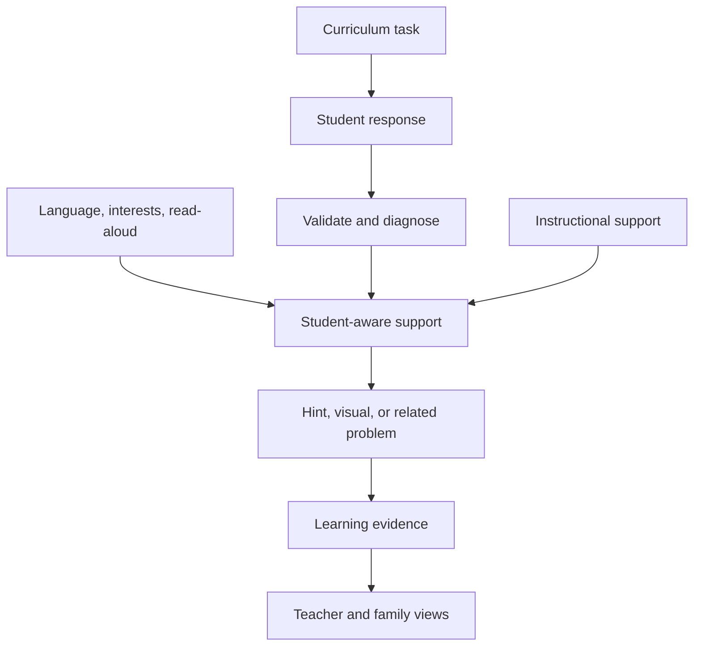

# MathBridge AI

**Student-aware support for learning mathematics**

[Project website](https://jovian-2wang.github.io/mathbridge-ai-project-page/) · [Live platform](https://mathbridge-ai.duckdns.org/) · [NSF award #2627693](https://www.nsf.gov/awardsearch/show-award/?AWD_ID=2627693)

MathBridge AI is a research prototype for Grade 6 mathematics learning. It connects a curriculum task with the student's response, learning preferences, and prior evidence so that the next hint, visual, or related problem responds to the learner's actual work.

This repository contains the public academic project page. The application source, credentials, student records, and backend remain in a separate private repository.

## Why MathBridge AI

A student often needs more than a correct or incorrect result. MathBridge AI is designed to identify what the student understands, locate the point of difficulty, and offer a useful next step without immediately revealing the answer.

Student preferences provide an additional presentation layer. The prototype can use a preferred language, selected interests, and optional read-aloud support while preserving the same mathematical structure and learning objective.

## One learning record, three views

| Experience | What it provides |
| --- | --- |
| **Student** | Course Mode and Free Math Help, structured hints, approved mathematical visuals, and related practice. |
| **Teacher** | Recent evidence, micro-skill signals, possible misconceptions, and information for choosing the next instructional move. |
| **Family** | A concise learning summary and short practice that support a useful conversation at home. |

## Learning loop



For a course task, the source prompt and target micro-skill anchor the interaction. The current runtime validates the response, diagnoses the attempt, and produces the next support. The academic page also distinguishes this running system from a proposed import-time extension for extracting and evaluating instructional supports from curriculum materials.

## Research context

MathBridge AI is presented in the context of [NSF award #2627693](https://www.nsf.gov/awardsearch/show-award/?AWD_ID=2627693), with UT San Antonio and the University of Florida shown as research institutions on the project page.

The current prototype demonstrates selected Grade 6 mathematics topics. The broader K–12 scope is a research direction, and the page does not claim measured learning gains.

## Project resources

- **Academic project page:** <https://jovian-2wang.github.io/mathbridge-ai-project-page/>
- **Live MathBridge AI platform:** <https://mathbridge-ai.duckdns.org/>
- **Public project-page source:** <https://github.com/jovian-2wang/mathbridge-ai-project-page>
- **Application source:** private repository
- **NSF award record:** <https://www.nsf.gov/awardsearch/show-award/?AWD_ID=2627693>

## Development and deployment

The project page is built with Astro and deployed as a static GitHub Pages site. A push to `main` runs the included GitHub Actions workflow and publishes the generated HTML.

<details>
<summary>Run the project page locally</summary>

Node.js 24 or newer is required.

```bash
npm ci
npm run dev
```

Build the static site with:

```bash
npm run build
```

</details>

## Credits

The page is adapted from Roman Hauksson-Neill's [Academic Project Page Template](https://github.com/RomanHauksson/academic-project-astro-template). The template identifies its license as [CC BY-SA 4.0](https://creativecommons.org/licenses/by-sa/4.0). Institutional marks remain the property of their respective institutions.
